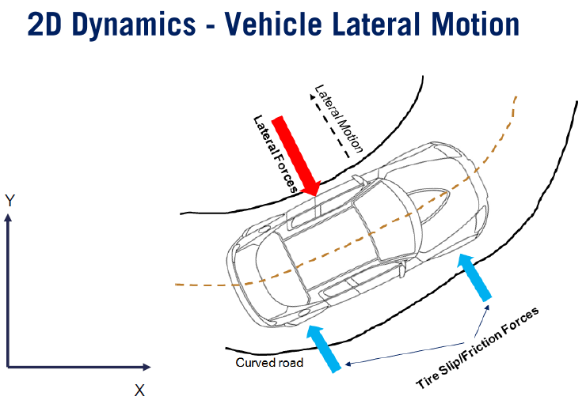
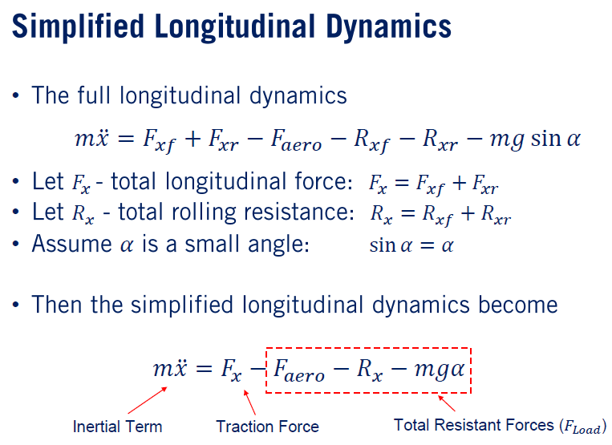

# Module4：Vehicle Dynamic Modeling

### Learning Objectives :

* Basics of coordinate frames and kinematics
* Develop a kinematic model for cars known as the bicycle model
* Explore the basics of dynamic modeling
* Vehicle longitudinal dynamics and modeling
* Vehicle lateral dynamics and modeling
* Vehicle Actuation System
* Tire slip and tire modeling

## Lession 1 : Kinematic Modeling in 2D

### Kinematic Modeling Vs Dynamic Modeline

### Coordinate Frames

1. **Inertial Coordinate Frame**

The global world or inertial coordinate frame, is a fixed reference frame attached to the earth. Often, we'll represent this coordinate frame as East North Up, ENU, relative to a reference point nearby. Or Earth-Centered Earth Fixed, ECEF, as is used in GNSS systems.

2. **Body Frame**

The Body frame is placed in some key location on the body of the vehicle. For example, the center of gravity of a vehicle or the center point of the rear axle. This frame is moving and rotating with respect to the fixed inertial frame as the vehicle moves about.

3. **Sensor Frame**
The sensor frame is a coordinate frame which attaches to each sensor describing the coordinates used for the sensor output. In many robotics applications, we need to attach several coordinates to a moving system and also represent elements from these frames in the inertial frame.

### Why we need Coordinate Transformation?

Even a simple two wheeled robot with a single sensor has three such frames to consider, while the self-driving car can have dozens. To maintain a consistent representation of sensor data for perception, we need to be able to transform information between coordinate frames.

					

In this figure, the vector v is presented with a green arrow in a two-dimensional coordinate frame. We have two coordinate frames displayed here. The body frame, defined by axes b_1 and b_2, and the inertial frame defined by axes e_1 and e_2, both in the 2D plane. Let's assume the two coordinate frames; frame e and frame b, have the same fixed origin. But frame b is rotated by some angle Theta relative to frame e. We can then define the rotational matrices C_EB, which transforms vectors from the frame b to the frame e and C_BE which projects the frame e onto frame b using the angle Theta as shown.

Now, let's extend our example to include a translation. Here, we see a two-wheeled robot and we'd like to represent the position of a point P observed by the robot in the robot body frame b, with respect to the inertial frame e. The position of the robot with respect to the inertial frame is x and y, and the orientation of the robot once again is Theta. The following equations relate the location of point P in the body coordinates P_B and the inertial frame P_E. Note that in general to transform one point from one coordinate to the other coordinate frame, body to inertial and vice versa, requires two terms. The translation of the origin O_BE and O_EB in this case, and the rotation of the axis C_EB and C_BE. Finally, we can summarize the transformation between two coordinate frames using homogeneous coordinates, which lead to a compact matrix multiplication to apply the transformation. We extend our location vector to include x, y, and one and can then transform from body to inertial coordinates using P inertial is C_EB and O_EB times P in the body frame.

## Lession 2 : The Kinematic Bicycle Model

The well-known kinematic bicycle model has long been used as a suitable control-oriented model for representing vehicles because of its simplicity and adherence to the nonholonomic constraints of a car. The bicycle model we'll develop is called the front wheel steering model, as the front wheel orientation can be controlled relative to the heading of the vehicle. In the proposed bicycle model, the front wheel represents the front right and left wheels of the car, and the rear wheel represents the rear right and left wheels of the car.

To analyze the kinematics of the bicycle model, we must select a reference point X, Y on the vehicle which can be placed at the center of the rear axle, the center of the front axle, or at the center of gravity or cg. The selection of the reference point changes the kinematic equations that result, which in turn change the controller designs that we'll use.

**States**
* Location of the rear axle reference point as xr, yr.
* Steering angle for the front wheel as Delta.
* The velocity is denoted v and points in the same direction as each wheel. This is an assumption referred to as the no slip condition, which requires that our wheel cannot move laterally or slip longitudinally either.

Our kinematic bicycle model takes as inputs the velocity and the steering rate Phi. The state of the system, including the positions XC, YC, the orientation Theta, and the steering angle Delta, evolve according to our kinematic equations from the model, which satisfy the no slip condition.

## Lession 3 : Dynamic Modeling in 2D

In vehicle modeling, when the vehicle is moving and turning at higher speeds, or when the road is slippery, the assumptions defined by the no slip condition may no longer hold. As the forces exerted on the vehicle cause the tires to slip over the pavement. Modeling the balance of forces during slip conditions can expand the set of driving conditions for which our model remains an accurate prediction of motion.

### Steps for Dynamic Modeling

To build a typical dynamic model, we can follow the following steps.

>   * First we set up the coordinate frames to be used in the model. For example, the body frame and the inertial frame we discussed before. 

>   * Next, we break down the dynamic system into lumped dynamic elements. These elements combine potentially distributed aspects of the system into discrete or lumped elements. 

>   * Next, we sketch the free body diagram for each rigid body in the list of elements. And properly name and model all the forces and moments acting on the body. 

>   * Finally, by using Newton's second law, we write the mathematical equations that define our dynamic model, summing all forces along each axis for translational dynamics.

In a rotational system, we sum the torques (tou) about each access of rotation and lump. Inertia is J, torsional springs and dampers in the same way as in the translational case. We refer to the rotational acceleration of a rigid body as alpha.

However, a full three-dimensional model of the vehicle, taking into account body roll and pitch. And arbitrarily inclined roads, and different forces and moments at each tire makes for a very complex model. Instead, it's possible to separate our model into two 2D models that split our vehicle control into a steering control and a throttle and brake control problem.

For these reasons, we'll build a separate **longitudinal** and **lateral** dynamic model for our self-driving car. The **longitudinal model** considers a vehicle traveling on an inclined road. We restrict the vehicle motion to the XZ plane. There are several forces acting on the vehicle body and tires, including the Traction force, the Rolling resistance, Aerodynamic force, and Gradient resistance force due to gravity.

The **Lateral Vehicle Dynamics model**, can be developed from motion in the xy plane. When looking at the vehicle from the top down or birds eye view. In this 2D model there is also several forces in the lateral direction acting on the vehicle such as the slip forces and centrifugal forces

## Lession 4 : Longitudinal Vehicle Modeling

## Lession 5 : Lateral Dynamics of Bicycle Model

We would like to extend our kinematic bicycle model to a dynamic model by relaxing the no slip condition and force for the kinematic model.
To start modeling the lateral dynamics of the bicycle model, the following assumptions will be made: 
> The forward longitudinal velocity is assumed constant. 
>   * This is done to decouple our lateral and longitudinal dynamic models, which simplifies our modeling task greatly, but does lead to modeling inaccuracies when accelerating or decelerating out of curves. 

> Second, as with the kinematic bicycle model, the left and right wheels for both front and rear axles are lumped into a single wheel each. 
>   * This assumption converts the four wheels to two wheels bicycle model. 

> Finally, other nonlinear effects such as suspension movement, road inclination, and aerodynamic forces are assumed to be negligible.

## Lession 6 : Vehicle Actuation

The main input to the lateral dynamics is steering angle and the main inputs to the longitudinal dynamics are throttle pedal position and brake pedal position. These inputs define some of the forces and moments that act on the vehicle and feed into the ordinary differential equations that govern the state of the vehicle.

### Steering

The steering model is simply the driver's command or the autonomy systems command to turn the vehicle to the right or left. The steering angle is translated into a wheel angle through a special mechanism and gear ratios that provide the lateral forces to keep the vehicle on a curved path. In the simplest model for the steering system, the wheel angle can be defined as proportional to the steering angle. So, the steering angle Delta S, is linearly proportional to the wheel angle Delta, with a steering coefficient C. This is sufficient for our work in simulation and is often used as a starting point for non-aggressive driving.

### Powertrain System (Driveline)

The vehicle power train determines the vehicles forward velocity and acceleration. In automatic transmission cars, a driver or the autonomy system has two inputs to accelerate or decelerate the vehicle, the gas, and brake. This diagram shows the mechanism to translate the driver or autonomy systems commands into wheel motions.

1. **Accelerating System**

The power flow diagram starts from the power generation unit such as the internal combustion engine or electric motor. A throttle pedal position drives the torque produced by the power generation unit. This torque is passed to the transmission system. In an automatic transmission system, the fluid coupling system or torque converter is placed between the engine shafts and the gearbox unit. Then, based on the operating mode and desired speeds, the gearbox changes the gear as needed. Gears one and two are torque modes and the higher gears are called speed modes, referring to the different modes of operation in the torque converter. Then the power flows to the wheels through a differential and generates the wheel torques, which ultimately generate traction forces. The traction force must be higher than the resistance force, which includes the aerodynamic force and road friction to accelerate the vehicle forward in the longitudinal direction. The power which is the source of the vehicle motion can be generated through combustion in an internal combustion engine or from the battery for an electric motor. Simply put, the driver puts their foot on the gas pedal to define the level of torque demand needed to accelerate the vehicle.

2. **Braking System**

The braking process starts from the driver commanded brake pedal position, which is translated into a brake pressure by the electronic control unit. The brake pressure results in a braking force on the brake disc or drum, which becomes a braking wheel torque at the wheel. The braking torque on the wheels creates a negative longitudinal force to decelerate the vehicle. Because of the control unit management of the braking torque, the response to the braking system is very predictable. Some of the primary functions of a braking system include: shortening stopping distance through hard braking, maintaining steerability during braking through anti-lock braking, maintaining stability during braking to avoid overturning.

## Lession 7 : Tire Modeling

The slip angle is the angle between the forward direction of the vehicle in the actual direction of its motion, which we denote Beta. The vehicle slip angle can be represented as the inverse tan of the lateral velocity, V_y divided by the longitudinal velocity, V_x. For small slip angles, we can use the small angle approximation and determine the slip angle Beta as the ratio between the lateral velocity, V_y and the longitudinal velocity, V_x directly.

The slip ratio captures the relationship between the deformation of the tire and the longitudinal forces acting upon it. When accelerating or breaking, the observed angular velocity of the tire does not match the expected velocity for the pure rolling motion, which means there is sliding between the tire and the road in addition to rolling. The difference between the rotation speed of the tire and the longitudinal speed of the car can be expressed as a ratio relative to the pure rolling speed, and it's called the slip ratio.

There are three cases of differences between the vehicle velocity and the angular tire velocity.

>   * First, when the vehicle velocity, v, is greater than the tire velocity, r, times w. In this case, the wheels are skidding. This happens during deceleration of the vehicle. 

>   * Second, when the vehicle velocity, v is less than the tire velocity, R_w. In this case, the wheels are spinning. This happens often in low friction driving on icy roads or when drifting of course. 

>   * Third, when the tire velocity is zero and the vehicle velocity is non-zero. In this case, the wheels are locked. This is an extension of our first case and can occur during emergency braking.

### Summary 

>   * The role of tire in vehicle dynamics.
>   * Slip angle and Slip ratio.
>   * The tire modeling models.

## Module Summary

>   * Kinematic and dynamic modeling of vehicles.
>   * Kinematic bicycle model.
>   * Lateral and Longitudinal dynamic model.
>   * Actuator and tire subsystem modeling.

