> System architectures for self-driving vehicles are extremely diverse, as no standardized solution has yet emerged. This module describes both the hardware and software architectures commonly used and some of the tradeoffs in terms of cost, reliability, performance and complexity that constrain autonomous vehicle design.

### Learning Objectives

* Design an omni-directional multi-sensor system for an autonomous vehicle
* Describe the basic architecture of a typical self-driving software system
* Break down the mapping requirements for self-driving cars based on their intended uses.

## Lesson 1: Sensors and Computing Hardware

Welcome to the first lesson of week two. This week we will discuss many details about the hardware and software architecture used in today's self-driving cars. In particular, we will cover the various sensors that can be used for perception. The computing platforms available today. The basics of designing sensor configurations for self-driving cars. The components of a typical autonomy software stack. And finally, we will conclude by discussing the various ways which we can represent the environment for self-driving. Hopefully by the end of this week you will have a broad understanding of the equipment and software ideas that go into making a self-driving car.

Let's begin this video. In this video, we will define sensors, and discuss the various types of sensors available for the task of perception. And we will then discuss the self-driving car hardware available nowadays. Let's begin by talking about sensors.

### 1. Sensors

> Categorization:
>
> * exteroceptive:extero = surroundings
> * proprioceptive: proprio = internal

Even the best perception algorithms are limited by the quality of their sensor data. And careful selection of sensors can go a long way to simplifying the self-driving perception task. So what is a sensor? **A sensor is any device that measures or detects some property of the environment, or changes to that property over time.** Sensors are broadly categorized into two types, depending on what property they record. If they record a property of the environment they are exteroceptive. Extero means outside, or from the surroundings. On the other hand, if the sensors record a property of the ego vehicle, they are proprioceptive. Proprios means internal, or one's own. Let's start by discussing common exteroceptive sensors.

### 2. Sensors for perception : Camera

We start with the most common and widely used sensor in autonomous driving, the camera. Cameras are a passive, light-collecting sensor that are great at capturing rich, detailed information about a scene. In fact, some groups believe that the camera is the only sensor truly required for self-driving. But state of the art performance is not yet possible with vision alone. While talking about cameras, we usually tend to talk about three important comparison metrics. We select cameras in terms of their resolution. The resolution is the number of pixels that create the image. So it's a way of specifying the quality of the image. We can also select cameras on the basis of field of view. The field of view is defined by the horizontal and vertical angular extent that is visible to the camera, and can be varied through lens selection and zoom.

Another important metric is the dynamic range. The dynamic range of the camera is the difference between the darkest and the lightest tones in an image. High dynamic range is critical for self-driving vehicles due to the highly variable lighting conditions encountered while driving especially at night. There is an important trade off cameras and lens selection, that lies between the choice of field of view and resolution. Wider field of view permit a lager viewing region in the environment. But fewer pixels that absorb light from one particular object. As the field of view increases, we need to increase resolution to still be able to perceive with the same quality, the various kinds of information we may encounter. Other properties of cameras that affect perception exist as well, such as focal length, depth of field and frame rate. We'll go into much more detail on cameras and computer vision in course three on visual perception.

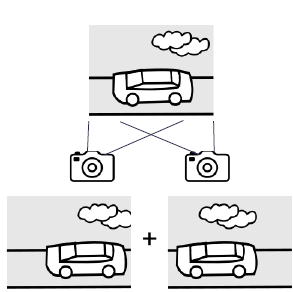

The combination of two cameras with overlapping fields of view and aligned image planes is called the stereo camera. **Stereo cameras allow depth estimation from synchronized image pairs.** Pixel values from image can be matched to the other image producing a disparity map of the scene. This disparity can then be used to estimate depth at each pixel. Next we have LIDAR which stands for light detection and ranging sensor.

### 3. Sensors for perception : LIDAR

> Comparison metrics :
>
> * Number of beams
> * Points per second
> * Rotation rate
> * Field of view

LIDAR sensing involves shooting light beams into the environment and measuring the reflected return. By measuring the amount of returned light and time of flight of the beam. Both in intensity in range to the reflecting object can be estimated. LIDAR usually include a spinning element with multiple stacked light sources. And output a three dimensional point cloud map, which is great for assessing scene geometry. Because it is an active sensor with it's own light sources, LIDAR are not effected by the environments lighting. So LIDAR do not face the same challenges as cameras when operating in poor or variable lighting conditions.

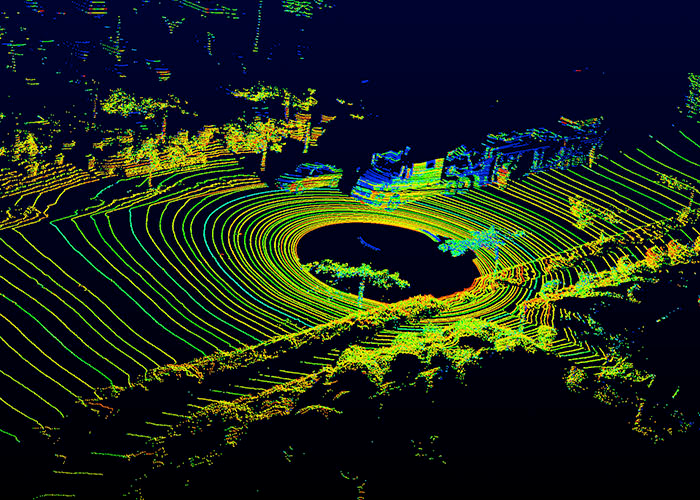

Let's discuss the important comparison metrics for selecting LIDAR. The first is the number of sources it contains with 8, 16, 32, and 64 being common sizes. And the second is the points per second it can collect. The faster the point collection, the more detailed the 3D point cloud can be. Another characteristic is the rotation rate. The higher this rate, the faster the 3D point clouds are updated. Detection range is also important, and is dictated by the power output of the light source. And finally, we have the field of view, which once again, is the angular extent visible to the LIDAR sensor. Finally, we should also mention the new LIDAR types that are currently emerging. High-resolution, solid-state LIDAR. Without a rotational component of the typical LIDARs, these sensors stand to become extremely low-cost and reliable. Thanks to being implemented entirely in silicon. HD solid-state LIDAR are still a work in progress. But definitely something exciting for the future of affordable self-driving. Our next sensor is RADAR, which stands for radio detection and ranging.

### 4. Sensors for perception : RADAR

> Comparison metrics
>
> * range
> * field of view
> * position and speed accuracy

RADAR sensors have been around longer than LIDAR and robustly detect large objects in the environment. They are particularly useful in adverse weather as they are mostly unaffected by precipitation. Let's discuss some of the comparison metrics for selecting RADAR. RADAR are selected based on detection range, field of view, and the position and speed measurement accuracy.

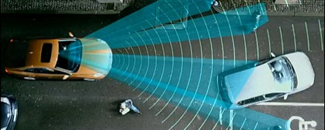

RADAR are also typically available as either having a wide angular field of view but short range. Or having a narrow filed of view but a longer range. The next sensor we are going to discuss are ultrasonics or sonars. Originally so named for sound navigation and ranging. Which measure range using sound waves.

### 5. Sensors for perception : Ultrasoncis

Sonar are sensors that are short range in inexpensive ranging devices. This makes them good for parking scenarios, where the ego-vehicle needs to make movements very close to other cars.

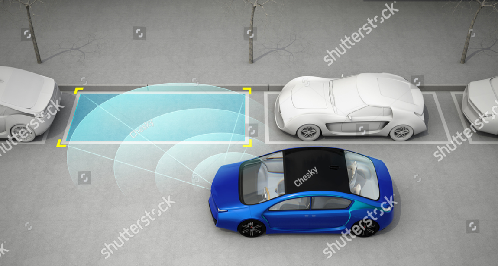Another great thing about sonar is that they are low-cost. Moreover, just like RADAR and LIDAR, they are unaffected by lighting and precipitation conditions. Sonar is selected based on a few key metrics. The maximum range they can measure, the detection field of view, and their cost.

### 6. Sensors for perception : GNSS/IMU

> Direct measure of ego vehicle states
>
> * position,velocity\(GNSS\)
>   * Varying accuracies : RTK,PPP,DGPS
> * angular rotation rate\(IMU\)
> * acceleration\(IMU\)
> * heading\(IMU,GPS\)

Now let's discuss the proprioceptive sensors, the sensors that sense ego properties. The most common ones here are Global Navigation Satellite Systems, GNSS for short, such as GPS or Galileo. An inertial measurement units or IMU's. GNSS receivers are used to measure ego vehicle position, velocity, and sometimes heading. The accuracy depends a lot on the actual positioning methods and the corrections used. Apart from these, the IMU also measures the angular rotation rate, accelerations of the ego vehicle, and the combined measurements can be used to estimate the 3D orientation of the vehicle. Where heading is the most important for vehicle control. And finally we have wheel odometry sensors. This sensor tracks the wheel rates of rotation, and uses these to estimate the speed and heading rate of change of the ego car. This is the same sensor that tracks the mileage on your vehicle.

So, to summarize, the major sensors used nowadays for autonomous driving perception include cameras, RADAR, LIDAR, sonar, GNSS, IMUs, and wheel odometry modules. These sensors have many characteristics that can vary wildly, including resolution, detection range, and field-of-view. Selecting an appropriate sensor configuration for a self-driving car is not trivial. Here's a simple graphic that shows each of the sensors and where they usually go on a car.

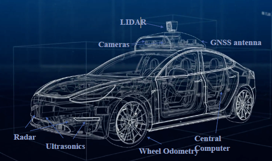

We will revisit this chart again in the next video, when we discuss how to select sensor configurations to achieve a particular operational design domain.

### 7. Computing Hardware

Finally, let's discuss a little bit about the computing hardware most commonly used in today's self-driving cars. The most crucial part is the computing brain, the main decision making unit of the car. It takes in all sensor data and outputs the commands needed to drive the vehicle. Most companies prefer to design their own computing systems that match the specific requirements of their sensors and algorithms. Some hardware options exist, however, that can handle self-driving computing loads out of the box. The most common examples would be Nvidia's Drive PX and Intel & Mobileye's EyeQ.

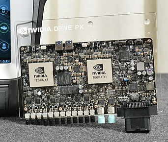

Any computing brain for self-driving needs both serial and parallel compute modules. Particularly for image and LIDAR processing to do segmentation, object detection, and mapping. For these we employ GPUs, FPGAs and custom ASICs, which are specialized hardware to do a specific type of computation. For example; the drive PX units include multiple GPUs. And the EyeQs have FPGAs both to accelerate parallalizable compute tasks, such as image processing or neural network inference. And finally, a quick comment about synchronization. Because we want to make driving decisions based on a coherent picture of the road scene. It is essential to correctly synchronize the different modules in the system, and serve a common clock. Fortunately, GPS relies on extremely accurate timing to function, and as such can act as an appropriate reference clock when available. Regardless, sensor measurements must be timestamped with consistent times for sensor fusion to function correctly.

Let's summarize. In this video, we learned about sensors and their different types based on what they measure. We covered the major sensors used in self-driving hardware systems, and discussed the advantages and comparison metrics. And then we briefly discussed the self-driving computing hardware available today. Hopefully, this solidifies some of the concepts we learned last week for doing autonomous perception. In the next lesson, we'll take a step further and look at how to select an appropriate sensor configuration for your self-driving car. See you in the next video.

## Lesson 2: Hardware Configuration Design

We will cover the configuration design to meet sensor coverage needs for an autonomous driving car. We will do this by going through two common scenarios, driving on a highway and driving in an urban environment. sensors come in different configurations and have different ranges in fields of view over which they can sense. They have some resolution that depends on the instrument specifics and field of view. Before we move to discussing coverage, let's define the deceleration rates we're willing to accept for driving which will drive the detection ranges needed for our sensors. Aggressive deceleration are set at five meters per second squared which is roughly the deceleration you experience when you slam the brakes hard and try to stop abruptly in case of an emergency. Normal decelerations are set to two meters per second squared, which is reasonably comfortable while still allowing the car to come to a stop quickly. Given a constant deceleration our braking distance d can be computed as follows. D is equal to v squared over 2a, where V is the vehicle velocity and a is its rate of deceleration. We can also factor in reaction time of the system and road surface friction limits, but we'll keep things simple in this discussion.

### Where to place sensors?

The question we want to answer is where should we place our sensors so that we have sufficient input for our driving task? Practically speaking, we want our sensors to capture the ODD we have in mind or the ODD our system can produce decisions for. We should be able to provide all of the decisions with sufficient input. There can be so many possible scenarios in driving but we'll look at just two common scenarios to see how the requirements drive our sensor selection. Will look at highway and urban driving. Let's think about these two situations briefly. For a divided highway, we have fast moving traffic, usually high volume, and quite a few lanes to monitor, but all vehicles are moving in the same direction. The other highlight of driving on a highway setting is that there are fewer and gradual curves and we have exits and merges to consider as well. On the other hand, in the urban situation we'll consider, we have moderate volume and moderate speed traffic with fewer lanes but with traffic moving in all directions especially through intersections.

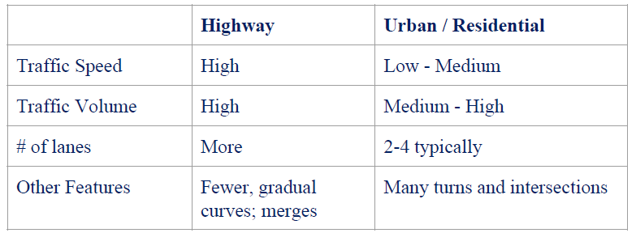

### Highway Scenario

> Broadly, 3 kinds of maneuvers:
>
> * Emergency Stop
> * Maintain Speed
> * Lane Change

Let's start with the highway setting. We can break down the highway setting into three basic maneuver needs. We may need to hit the brakes hard if there's an emergency situation. We need to maintain a steady speed matching the flow of traffic around us and we might need to change lanes. In the case of an emergency stop, if there is a blockage on our road we want to stop in time. So, applying our stopping distance equation longitudinally, we need to be able to sense about a 110 meters in front of us assuming a highway speed of a 120 kilometers and aggressive deceleration. Most self-driving systems aim for sensing ranges of a 150 to 200 meters in front of the vehicle as a result. 

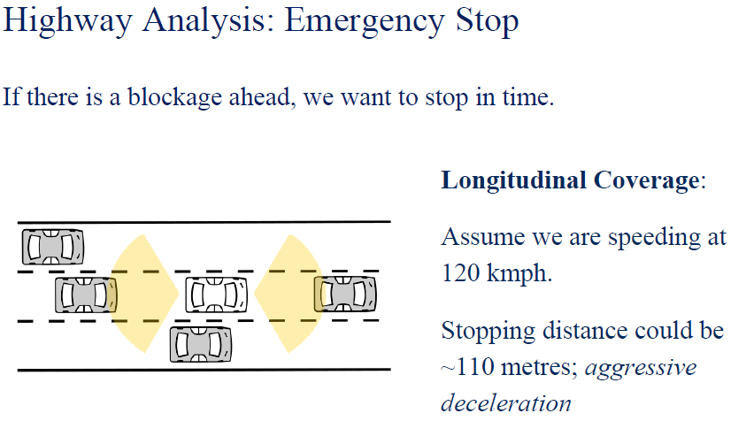

Similarly, to avoid lateral collision or to change lanes to avoid hitting an obstacle in our lane, we need to be able to sense at least our adjacent lanes, which are 3.7 meters wide in North America. 

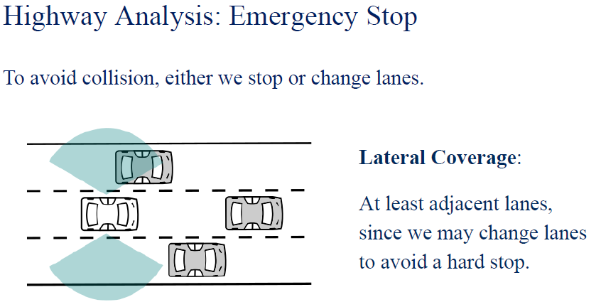

To maintain speed during vehicle following, we need to sense the vehicle in our own lane. Both their relative position and the speed are important to maintain a safe following distance. This is usually defined in units of time for human drivers and set to two seconds in nominal conditions. It can also be assessed using aggressive deceleration of the lead vehicle and the reaction time from our ego vehicle. So, at a 120 kilometers per hour, relative position and speed measurements to a range of 165 meters are needed and typical systems use 100 meters for this requirement. 

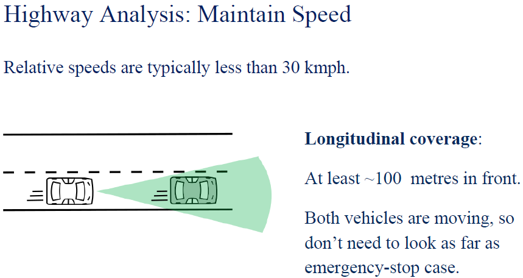

Laterally, we need to know what's happening anywhere in our adjacent lanes in case another vehicles seeks to merge into our lane or we need to merge with other traffic. A wide 160 to 180 degree field of view is required to track adjacent lanes and a range of 40 to 60 meters is needed to find space between vehicles. 

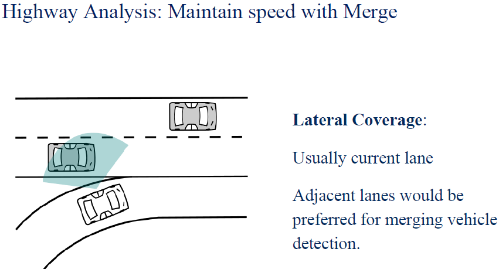

Finally, let's discuss the lane change maneuver and consider the following scenario.

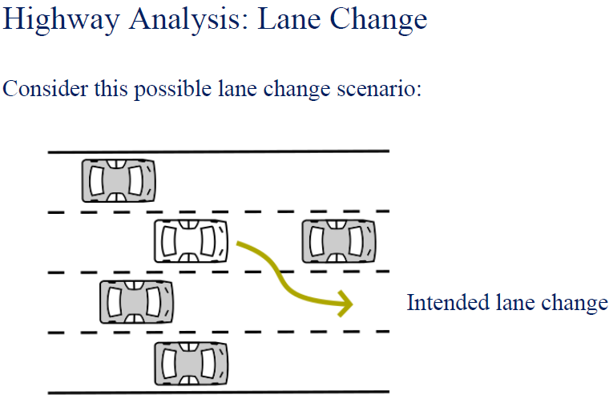

Suppose we want to move to the adjacent lane, longitudinally we need to look forward, so we are a safe distance from the leading vehicle and we also need to look behind just to see what the rear vehicles are doing.

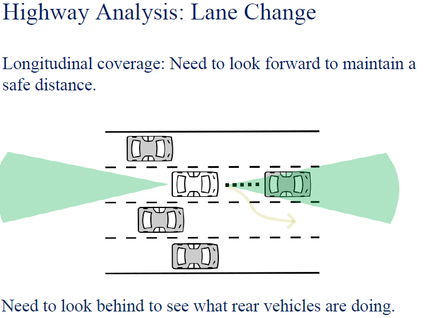

Laterally it's a bit more complicated. We may need to look beyond just the adjacent lanes. 
For example, what if a vehicle attempts to maneuver into the adjacent lane at the same time as we do? We'll need to coordinate our lane change room maneuvers so we don't crash. The sensor requirements for lane changes are roughly equivalent to those in the maintain speed scenario. As both need to manage vehicles in front of and behind the ego vehicle as well as to each side. 

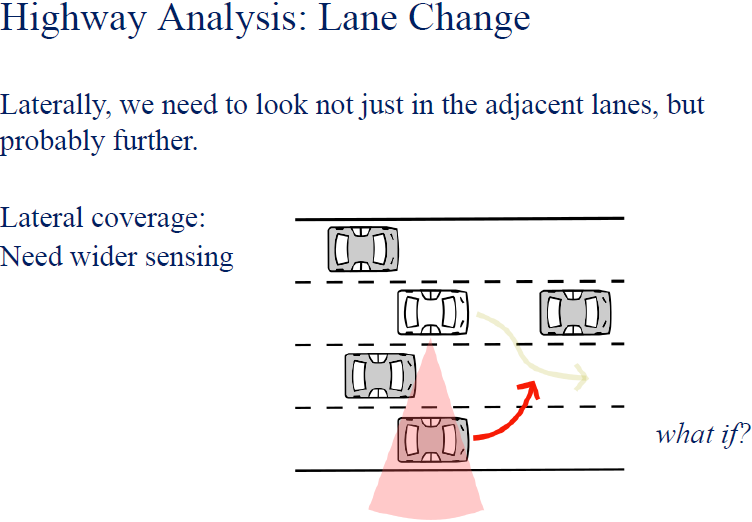

Overall, this gives us the picture for coverage requirements for the highway driving scenario. We need longitudinal sensors and lateral sensors and both wide field of view and narrow field of view sensors to do these three maneuvers, the emergency stop, maintaining speed and changing lanes. Already from this small set of ODD requirements we see a large variety of sensor requirements that arise.

### Urban Scenario

> Broadly, 6 kinds of maneuvers:
>
> * Emergency Stop
> * Maintain Speed
> * Lane Change
> * Overtaking
> * Turning cross, at intersections
> * Passing roundabouts

The urban scenario as we discussed before is a moderate volume, moderate traffic scenario with fewer lanes on the highway case but with the added complexity of pedestrians. There are six types of basic maneuvers here. Obviously, we can still perform *emergency stop*, *maintain speed* and *lane changes* but we also have scenarios such as overtaking a **parked car, left and right turns at intersections** and more complex maneuvers through intersections such as **roundabouts**. In fact, for the first three basic maneuvers, the coverage analysis is pretty much the same as the highway analysis but since we are not moving as quickly, we don't need the same extent for our long-range sensing. Let's discuss the overtake maneuver next. More specifically, consider a case where you have to overtake a parked car. 

Longitudinally, we definitely need to sense the parked car as well as look for oncoming traffic. So, we need both sensors, wide short-range sensors to detect the parked car and narrow long-range sensors to identify if oncoming traffic is approaching. 

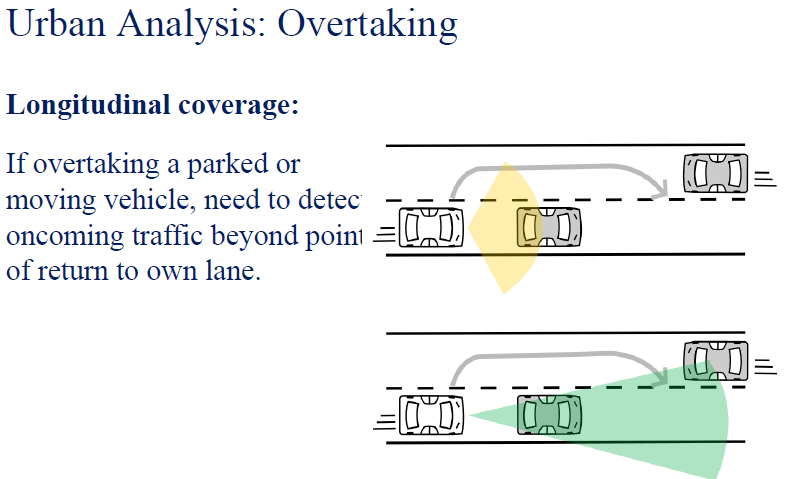

And laterally, we'll need to observe beyond the adjacent lanes for merging vehicles as we did in the highway case. 

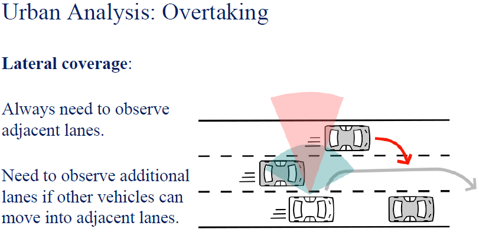

For intersections, we need to have near omni-directional sensing for all kinds of movements that can occur. Approaching vehicles, nearby pedestrians, doing turns and much more.

Finally, for roundabouts we need a wide-range, short distance sensor laterally since the traffic is slow but we also need a wide-range short distance sensor longitudinally because of how movement around the roundabout occurs. 

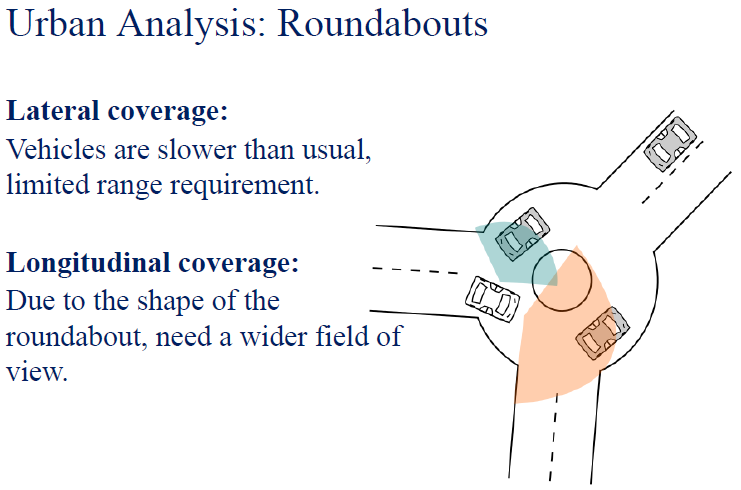

We need to sense all of the incoming traffic flowing through the roundabout to make proper decisions. And so we end up with this overall coverage diagram for the urban case.

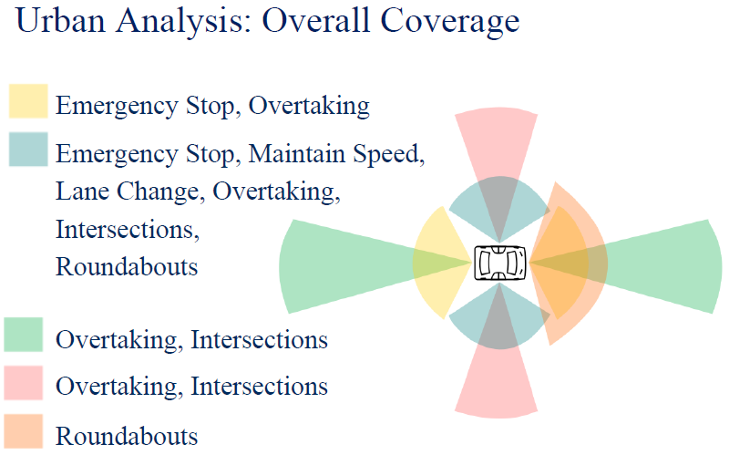

### Summary

To summarize, our choice of sensors should be driven by the requirements of the maneuvers we want to execute and it should include both long-range sensors for longitudinal dangers and wide field of view sensors for omnidirectional perception. The final choice of configurations also depends on our requirements for operating conditions, sensor redundancy due to failures and on budget. There is no single answer to which sensors are needed for a self-driving car. In this lesson, you learned how to select a hardware configuration by doing sensor coverage analysis both for longitudinal and lateral cases for highway and urban driving.

## Lesson 3: Software Architecture

> Learning Objectives
> 
> Describe the basic architecture of a typical self-driving software system
> Identify the standard software decomposition
>   * Environment Perception
>   * Environment Mapping
>   * Motion Planning
>   * Controller
>   * System Supervisor

### Software Architecture - High Level

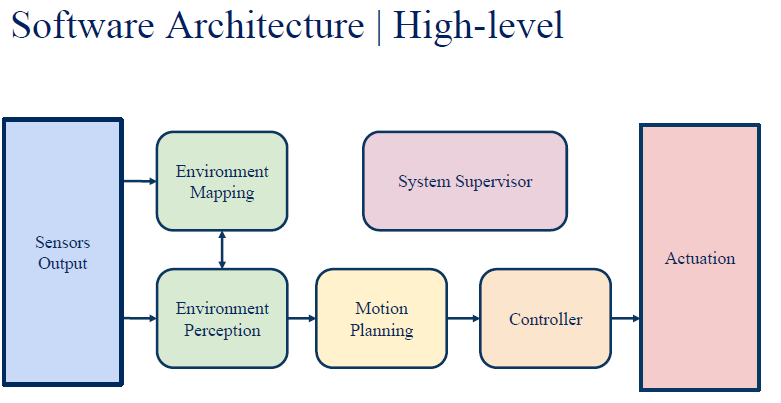

Let's take a look at the high level software architecture for a self driving car's software stack.The car observes the environment around it, using a variety of sensors. 

The **raw sensor measurements** are passed into two sets of modules dedicated to understanding the environment around the car. 

The **environment perception** modules have two key responsibilities, first, identifying the current location of the autonomous vehicle in space, and second, classifying and locating important elements of the environment for the driving task. Examples of these elements include other cars, bikes, pedestrians, the road, road markings, and road signs, anything that directly affects the act of driving. 

The **environment mapping** module creates a set of maps which locate objects in the environment around the autonomous vehicle for a range of different uses, from collision avoidance to egomotion tracking and motion planning. 

The **motion planning** module makes all the decisions about what actions to take and where to drive based on all of the information provided by the perception and mapping modules. The motion planning module's main output is a safe, efficient and comfortable planned path that moves the vehicle towards its goal. The planned path is then executed by the fourth module, the controller. 

The **controller module** takes the path and decides on the best steering angle, throttle position, brake pedal position, and gear settings to precisely follow the planned path.

The **system supervisor** monitors all parts of the software stack, as well as the hardware output, to make sure that all systems are working as intended. The system supervisor is also responsible for informing the safety driver of any problems found in the system.

### Software Architecture - Environment Perception

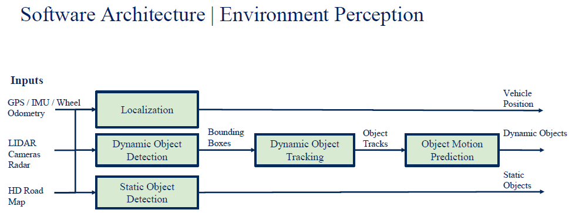

There are two important parts of the perception stack, **localizing the ego-vehicle in space** , as well as **classifying and locating the important elements** of the environment. 

The **localization module** takes in multiple streams of information, such as the current GPS location, IMU measurements and wheel odometry. It then combines them to output an accurate vehicle location. For greater accuracy, some localization modules also incorporate LIDAR and camera data. Typically, the problem of classification and localization of the environmental elements is divided into two segments, first, detecting dynamic objects in the environment, and second, detecting the static objects in the environment. 

The dynamic **object detection module** uses a set of camera inputs as well as LIDAR point clouds to create 3D bounding boxes around dynamic objects in the scene. The 3D bounding boxes encode the class or type of object as well as the exact position, orientation and size of the object. Once detected, the dynamic objects are tracked over time by a tracking module. 

The **tracker module** provides not only the current position of the dynamic objects but also the history of its path through the environment. The history of the path is used along with the roadmaps In order to predict the future path of all dynamic objects. 

This is usually handled by a **prediction module** , which combines all information regarding the dynamic object and the current environment to predict the path of all dynamic objects. 

The **static object detection module** also relies on a combination of camera input and LIDAR data to identify significant static objects in the scene. Such important data include the current lane in which the self-driving vehicle is found, and the location of regulatory elements such as signs and traffic lights.

### Software Architecture - Environment Maps

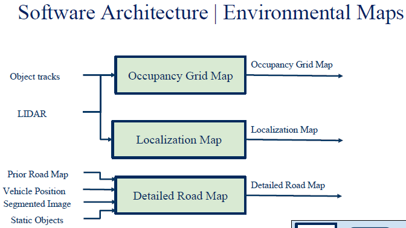

Environment maps create several different types of representation of the current environment around the autonomous car. There are three types of maps that we discuss briefly, the occupancy grid map, the localization map and the detailed road map. The occupancy grid is a map of all static objects in the environment surrounding the vehicle. LIDAR is predominantly used to construct the occupancy grid map. A set of filters are first applied to the LIDAR data to make it usable by the occupancy grid. For example, the drivable surface points and dynamic object points are removed. The occupancy grid map represents the environment as a set of grid cells and associates a probability that each cell is occupied. This allows us to handle uncertainty in the measurement data and improve the map over time. The localization map, which is constructed from LIDAR, or camera data, is used by the localization module in order to improve eco state estimation. Sensor data is compared to this map while driving to determine the motion of the car relative to the localization map. This motion is then combined with other proprioceptor sensor information to accurately localize the eco vehicle. The detailed road map provides a map of road segments which represent the driving environment that the autonomous vehicle is currently driving through. It captures signs and lane markings in a manner that can be used for motion planning. This map is traditionally a combination of prerecorded data as well as incoming information from the current static environment gathered by the perception stack. The environment mapping and perception modules interact significantly to improve the performance of both modules. For example, the perception module provides the static environment information needed to update the detailed road map, which is then used by the prediction module to create more accurate dynamic object predictions.

### Software Architecture - Motion Planning

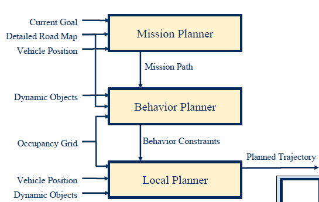

Motion planning for self-driving cars is a challenging task, and it's hard to solve in a single integrated process. Instead, most self-driving cars today use a decomposition that divides the problem into several layers of abstraction as follows. At the top level, **the mission planner** handles long term planning and defines the mission over the entire horizon of the driving task, from the current location, through the road network to its final destination. To find the complete mission, the mission planner determines the optimal sequence of road segments that connect your origin and destination, and then passes this to the next layer. The **behavior planner** is the next level of abstraction, solving short term planning problems. The behaviour planner is responsible for establishing a set of safe actions or maneuvers to be executed while travelling along the mission path. An example of the behaviour planner decisions would be whether the vehicle should merge into an adjacent lane given the desired speed and the predicted behaviors of nearby vehicles. Along with the maneuver of decisions, the behavior planner also provides a set of constrains to execute with each action, such as how long to remain in the current lane before switching. Finally, the **local planner** performs immediate or reactive planning, and is responsible for defining a specific path and velocity profile to drive. The local plan must be smooth, safe, and efficient given all the current constraints imposed by the environment and maneuver. In order to create such a plan, the local planner combines information provided by the behavior planner, occupancy grid, the vehicle operating limits, and other dynamic objects in the environment. **The output of the local planner is a planned trajectory which is a combined desired path and velocity profile for a short period of time into the future.**

### Software Architecture - Vehicle Controller

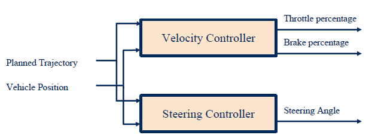

Let's see how a typical vehicle controller takes the given trajectory and turns it into a set of precise actuation commands for the vehicle to apply. A typical controller separates the control problem into a **longitudinal control** and a **lateral control** . The lateral controller outputs the steering angle required to maintain the planned trajectory, whereas the longitudinal controller regulates the throttle, gears and braking system to achieve the correct velocity. Both controllers calculate current errors and tracking performance of the local plan, and adjust the current actuation commands to minimize the errors going forward.

### Software Architecture - System Supervisor

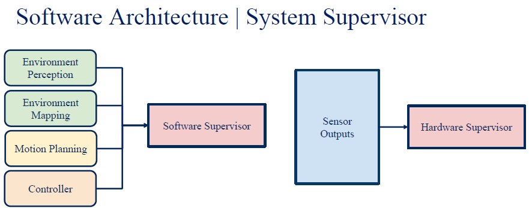

The system supervisor is the module that continuously monitors all aspects of the autonomous car and gives the appropriate warning in the event of a subsystem failure. There are two parts, the hardware supervisor, and the software supervisor. The hardware supervisor continuously monitors all hardware components to check for any faults, such as a broken sensor, a missing measurement, or degraded information. Another responsibility of the hardware supervisor is to continuously analyze the hardware outputs for any outputs which do not match the domain which the self-driving car was programmed to perform under. For example, if one of the camera sensors is blocked by a paper bag or if snow is falling and corrupting the LIDAR point cloud data. The software supervisor has the responsibility of validating this software stack to make sure that all elements are running as intended at the right frequencies and providing complete outputs. The software supervisor also is responsible for analyzing inconsistencies between the outputs of all modules.

### Summary

We looked at the basic software architecture of a typical self-driving software system. In fact, we looked at the decomposition of five major modules and their responsibilities. These included: **environment perception** , **environment mapping** , **motion planning** , **vehicle controller** and, finally, the **system supervisor** .

## Lesson 4: Environment Representation

> Environmental Map Types
>
> * Localization of vehicle in the environment.
>   * Localization point cloud or feature map.
> * Collision avoidance with static objects.
>   * Occupancy grid map.
> * Path planning.
>   * Detailed road map.

### Localization Maps

This map is created using a continuous set of lidar points or camera image features as the car moves through the enviromment. This map is then used in combination with GPS, IMU and wheel odometry by the localization module To accurately estimate the precise location of the vehicle at all times. As new LIDAR camera data is received it is compared to the localization map and a measurement of the eagle vehicles position is created by aligning the new data with the existing map. This measurement is then combined with other sensors to estimate eagle motion and ultimately used to control the vehicle Here we have some recorded LIDAR data from our self-driving car. The movement of the vehicle is clear based on the evolution of the LIDAR points in this video. As the car drives out of a driveway and onto the street ahead. This detailed evolving representation of the motion of a car through its environment Is extremely valuable for the localization module. The localization map can be quite large, and many methods exist to compress it's contents and keep only those features that are needed for localization.

### Occupancy Grid Map

The occupancy grid is a 2D or 3D discretized map of the static objects in the environments surrounding the eagle vehicle. This map is created to identify all static objects around the autonomous car, once again, using point clouds as our input. The objects which are classified as static include trees, buildings, curbs, and all other nondriveable surfaces. For example, in this grid map, if all occupied grids were colored in, this is what the occupancy grid may look like. As the occupancy grid only represents the static objects from the environment, all dynamic objects must first be removed. This is done by removing all lidar points that are found within the bounding boxes of detected dynamic objects identified by the perception stack. Next, static objects which will not interfere with the vehicle are also removed. Such as dryable service or any over hanging tree branches. As result of these steps only the relevent writer points from static objects from the environment remain. The filtering process is not perfect and so it is not possible to blindly trust the remaining points are in fact obstacles The occupancy grid, therefore, represents the environment probabilistically, by tracking the likelihood that a grid cells occupy over time. This map is then relied on to create paths for the vehicle which are collusion-free.

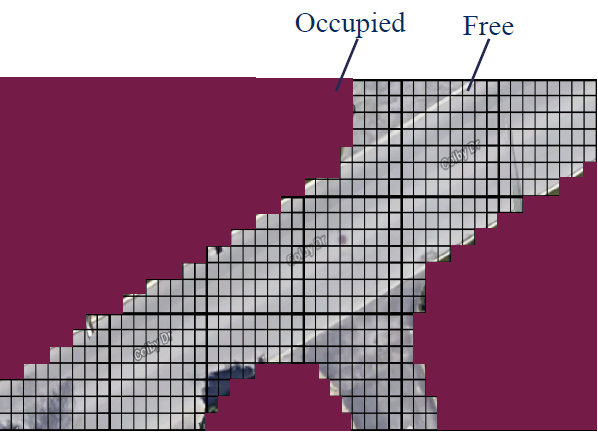

### Detailed Road Map

> 3 Methods of creation :
>   * Fully Online
>   * Fully Offline
>   * Created offline and Updated Online

The detailed roadmap is a map of the full road network which can be driven by the self-driving car. This map contains information regarding the lanes of a road, as well as any traffic regulation elements which may affect them. The detailed road map is used to plan a safe and efficient path to be taken by the self-driving car. The detailed road map can be created in one of three ways. Fully online, fully offline, or created offline and updated online. A map which is created fully online relies heavily on the static object proportion of the perception stack to accurately label and correctly localize all relevant static objects to create the map. This includes all lane boundaries in the current driving environment, any regulation elements, such as traffic lights or traffic signs, any regulation attributes of the lanes, such as right turn markings or crosswalks. This method of map creation is rarely used due to the complexity of creating such a map in real time. A map which is created entirely offline is usually done by collecting data of a given road several times. Specialized vehicles with high accuracy sensors are driven along roadways regularly to construct offline maps. Once the collection is complete, the information is then labelled with the use of a mixture of automatic labelling from static object perception and human annotation and correction. This method of map creation, while producing very detailed and accurate maps, is unable to react or adapt to a changing environment. The third method of creating detailed roadmaps is to create them offline and then update them online with new, relevant information. This method of map creation takes advantage of both methods, creating a highly accurate roadmap which can be updated while driving.

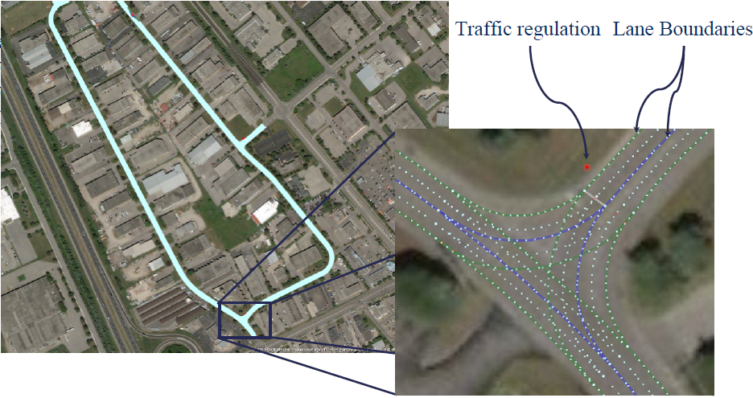

## Module Summary

> Understand various sensor and computing hardware used for autonomous driving
>   * The relative strengths and weaknesses
> Understand the design of hardware sensor configurations for autonomous driving
>   * Describe the basic architecture of a typical self-driving software system
> Understand the standard decomposition for each software module
>   * Define the different types of maps used in autonomous driving

