### Learning Objective

* Autonomous vehicle crash reports
* Safety concepts
* Hazard sources
* Industry perspectives on safety
* Safety frameworks for self driving

## Lession 1: Safety Assurance for Self-Driving Vehicles

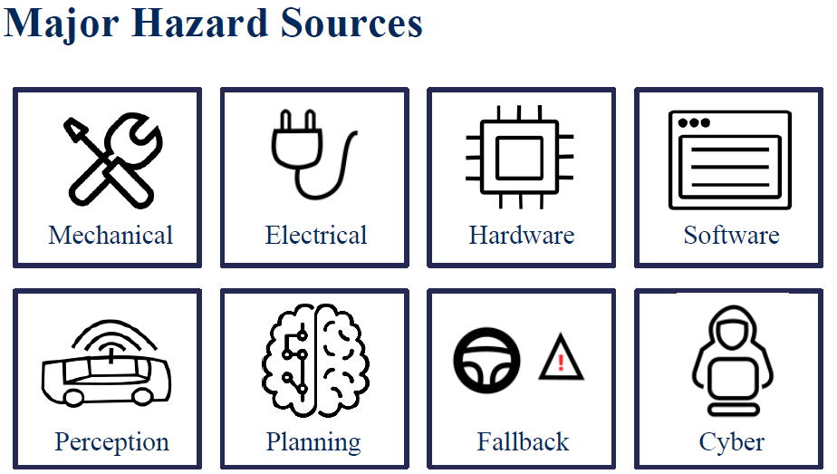

**Harm** to refer to the physical harm to a living thing, and **risk** refers to describe the probability that an event occurs, combined with the severity of the harm, that the event can cause. We can now describe safety as the process of avoiding unreasonable risk of harm to a living thing. For example, driving into an intersection when the traffic signal is red would be unsafe as it leads to unreasonable risk to harm of the occupants of the vehicle and to other vehicles moving through the intersection. Finally, a **hazard** is a potential source of unreasonable risk of harm or a threat to safety. So, if my system software has a bug that could potentially cause an accident, the software bug would be a hazard.

Main categories of hazards that are regularly considered; mechanical, electrical, computing hardware, software, perception, planning, driving-task fallback, and cybersecurity. Each of these hazards requires different approaches when assessing overall system safety.

### NHTSA FRAMEWORK

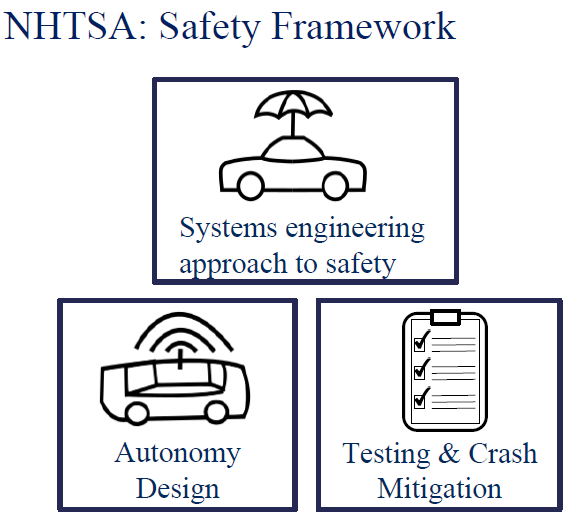

In the US, the National Highway Transportation Safety Administration or NHTSA, has defined a twelve-part safety framework to structure safety assessment for autonomous driving. This framework was released as a suggested, not mandatory framework to follow in 2017. The framework itself consists of 12 areas or elements any autonomous driving company should focus on or rather, are encouraged to focus on. First, a **system design approach** to safety should be adopted, and this really permeates the entire framework document. Well-planned and controlled software development processes are essential, and the application of existing SAE and ISO standards from automotive, aerospace, and other relevant industries should be applied where relevant. For the remaining 11 areas, we can organize them loosely into two categories.

### Autonomy Design

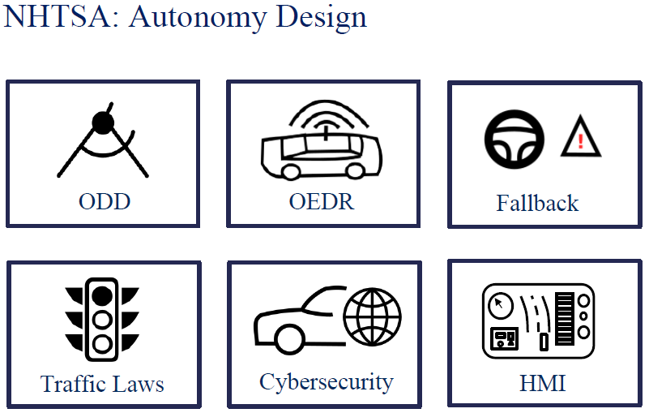

Autonomy design, which requires certain components to be included and considered in the autonomy software stack, and testing and crash mitigation, which covers approaches to testing the autonomy functions and ways to reduce the negative effects of failures, as well as learning from them.

>   * The NHTSA encourages a **well-defined operational design domain**, so that the designers are well aware of the flaws of this and limitations of the system, and can make an assessment as to which scenarios are supported and safe in advance of testing or deployment. 

>   * Next, it encourages a **well-tested object and event detection and response system**, which is critical to perception and crash avoidance. 

>   * It encourages the car to have a reliable and convenient fallback mechanism by which the driver is alerted or the car is brought to safety autonomously. It is essential to develop this mechanism keeping in mind that the driver may be inattentive. 

>   * The driving system should also be designed such that all the federal level, state level, and local laws for traffic are followed and obeyed within the ODD. 

>   * The framework encourages designers to think about cybersecurity threats, and how to protect the driving system from malicious agents. 

>   * Finally, there should be some thought put into the human machine interface, or HMI. So, the car should be able to well convey the status of the machine at any point in time to the passengers or the driver.

### Testing & Crash Mitigation

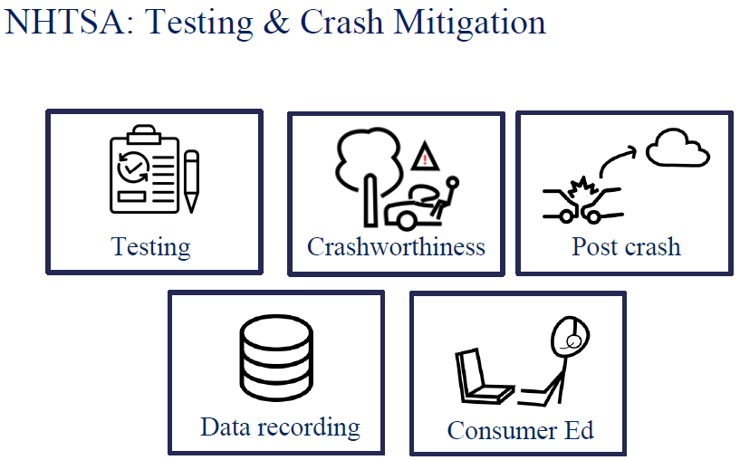

>   * The NHTSA recommends a strong and extensive testing program before any service is launched for the public. This testing can rely on three common pillars; simulation, close track testing, and public road driving.

>   * There should be careful consideration of methods to mitigate the extent of injury or damage that occurs during a crash event. Crashes remain a reality of public road driving and autonomy systems that can minimize crash energy and exceed passenger safety standards in terms of restraints, airbags, and crash worthiness should be the norm. 

>   * There should be support for post crash behavior. The car must be rapidly returned to a safe state, for example, brought to a stop with fuel pumps securing the fuel, first responders alerted, and so on.

>   * There should be an automated data recording function or black box recorder. It is very helpful to have this crash data to analyze and design systems that can avoid the specific kind of crash in the future, and to resolve questions about what went wrong, and who was at fault during the event. 

>   * There should be well-defined consumer education and training. So, courses for the fallback driver during testing and training for consumer drivers and passengers to better understand both the capabilities and limits of the deployed autonomous system.

## Lession 2:  Industry Methods for Safety Assurance and Testing

### Waymo : Safety Levels

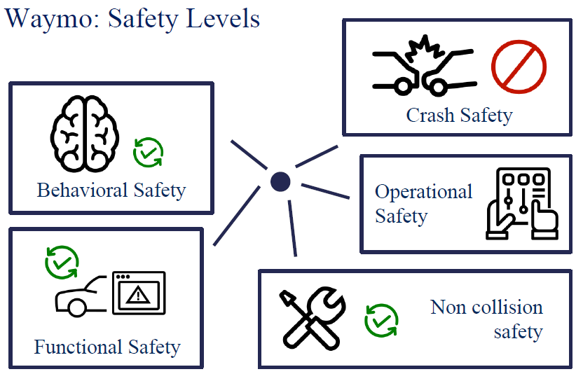

>   * Waymo covers all 12 of the NHTSA concepts, but organizes them into a five level safety approach. First, Waymo systems are designed to perform safe driving at the behavioral level. This includes decisions that follow the traffic rules, can handle a wide range of scenarios within the ODD, and maintain vehicle safety through it. 

>   * Second, Waymo ensures that the systems have backups and redundancies. This is so that even if a fault or failure occurs, the car can switch to a secondary component or a backup process to minimize the severity of failures and return the vehicle to a safe state, continuing the drive if possible. This is referred to as Functional Safety. 

>   * Next, Waymo emphasizes crash safety as recommended by the NHTSA. It designs systems that ensure minimum damage to people inside the car in the event of a crash. 

>   * Next, it tries to ensure Operational Safety. So, that means its interfaces are usable and convenient and intuitive. The focus here is on allowing passengers to have some level of control over the vehicle, but only in ways that maintain system safety. 

>   * Finally, Waymo fosters Non-collision safety. This refers to system designs that minimize the danger to people that may interact with the system in some way, first responders, mechanics, hardware engineers, and so on. 

>   * These five pillars form Waymo's safety by design system, and leads to a system of extensive requirement definition, design iteration, and testing to ensure that the objectives of the system are met by each component.

### Waymo : Safety Levels

> Identify hazard scenarios & potential mitigations

> Use hazard assessment methods to define safety requirements
>   * Preliminary analysis
>   * Fault tree
>   * Design Failure Modes & Effects Analyses

> Conduct extensive testing to make sure safety requirements are met

### Waymo : Levels of testing to ensure safety

> Simulation testing
>   * Test rigorously with simulation, thousands of variations, fuzzing of neighbouring vehicles

> To do this, they mine all of their on-road experiences for challenging scenarios and perform systematic scenario fuzzing, which changes the position and velocity parameters of other vehicles and pedestrians randomly, so they can test if the ego-vehicle behaves safely throughout all of them. This approach is particularly useful for finding hard edge cases

> Closed-course testing
>   * Follow 28 core + 19 additional scenario competencies on private test tracks
>   * Focus on four most common crashes:
>     * Rear-end, intersection, road departure, lane change

> Real-world driving
>   * Start with smaller fleet, expand steadily
>   * Already testing thousands of vehicles, with more on the way.

### GM : Safety Levels

GM's safety strategy does not try to reorganize or simplify the NHTSA guidance, but instead focuses on its implementation strategies for achieving the required safety assessments.

>   * First and foremost, GM emphasized their iterative design model, in which the first analyze scenarios, then build software, then simulate the scenarios, and test their software. Finally, deploy their software on real world cars, and they keep adding improvements and refinements to both the requirements and the autonomous system iteratively.

>   * Second, whereas Waymo relies on OEMs to design its vehicles and only discusses mechanical and electrical hazards related to its autonomy hardware, GM manufactures their cars entirely themselves and so can enforce a more integrated design with consistent quality standards throughout the self-driving hardware. 

>   * Next, GM ensures safety through a comprehensive risk management scheme. They identify and address risks and try to eliminate them completely and not just mitigate them. 

>   * Finally, all their systems follow there internally well defined standards of safety, reliability, security, and so on.

### GM : Safety Process

>   * First, they perform deductive analysis through the fault tree method and pinpoint components that could possibly have faults and address them. 

>   * Next, they perform inductive analysis through design, FMEA. So, they do a failure modes and effect analysis on their design proposals, and try to ensure safety from the bottom up. 

>   * Finally, they employ hazard and operability studies to perform exploratory analysis, and figure out when the system may potentially not work as expected.

### GM: Safety Thresholds

All GM vehicles are equipped with two key safety thresholds:
>   * Fail safes - There is redundant functionality (second controllers, backup systems etc) such that even if primary systems fail, the vehicle can stop normally.

>   * SOTIF - All critical functionalities are evaluated for unpredictable scenarios.

### GM: Testing

>   * Performance testing at different levels
>   * Requirements validation of components, levels
>   * Fault injection testing of safety critical functionality
>   * Intrusive testing such as electromagnetic interference, etc.
>   * Durability testing and simulation based testing

### Analytical vs Data Driven: Definitions
> Analytical Safety
>   * Ensuring the system works in theory and meets safety requirements found by hazard assessment

> Data driven safety
>   * Safety guarantee due to the fact that the system has performed autonomously without fail on the roads for a very large number of kms.

## Lession 3: Safety Frameworks for Self-Driving

### Generic Safety Frameworks - Fault Trees

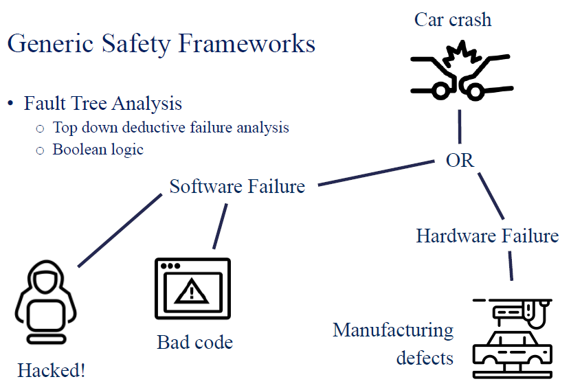

Fault trees can be used as a preliminary analysis framework, and can be steadily expanded to encompass as much details necessary. Fault trees are top-down flows in which we analyze a possible failure of a system to be avoided, and then identify all of the ways in which it can occur from events and failures at lower levels of the system. The top node in a fault tree is the root or top event. The intermediate nodes in the fault tree are logic gates, that define possible causes for the root event. The decomposition continues to a level of detail for which a probability of such an event can be defined. The fault tree can then be analyzed by combining the probabilities using the laws of Boolean logic. 

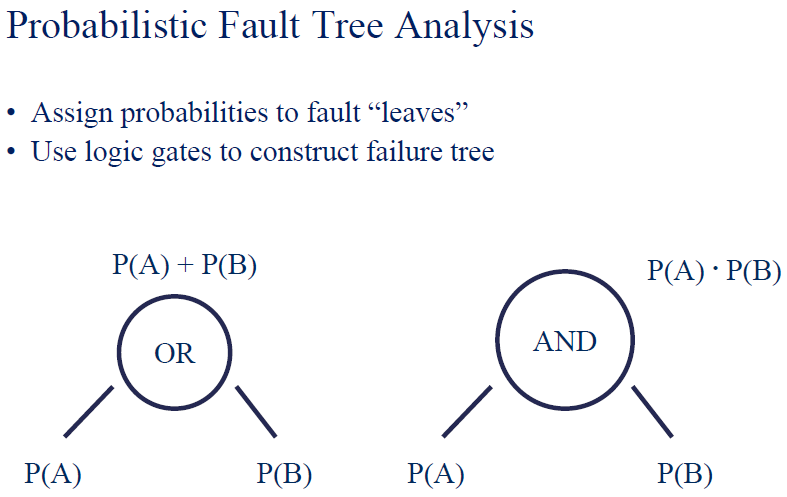

### Generic Safety Frameworks - Failure Mode and Effects Analyses (FMEA)

> Bottom up process to identify all the effects of faults in a
system

> Failure Mode
>   * Modes or ways in which a component of the system may fail

> Effects Analysis
>   * Analyzing effects of the failure modes on the operation of the system.

> FMEA: Idea

> Categorize failure modes by priority
>   * How serious are their effects?
>   * How frequently do they happen?
>   * How easily can they be detected?

> Eliminate or reduce failures, starting with top priority

### FMEA: Steps

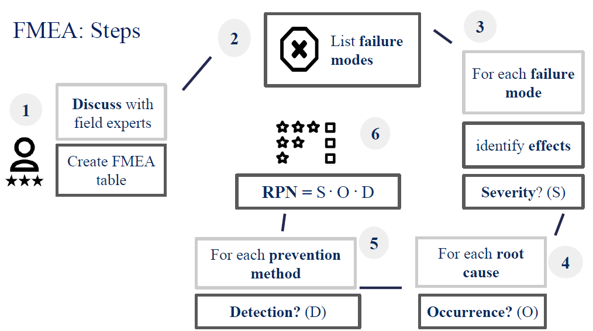

>   * First we begin with discussing with field experts and identifying processes at the level of detail we want in the table. 

>   * Then, we question the purpose of the system and list all failure possibilities. 

>   * Then for each failure possibility, we identify the possible consequences and assign each consequence a severity rating between one and 10, 10 being the most severe.

>   * For each consequence, we identify the possible root causes, and for each route cause, we assign another number between one and 10, to denote how frequently this cause occurs. 

>   * Then, we identify all the ways in which the failure mode can be detected by operator, maintenance, inspection, or a fault detection system. We assess the overall mode detection likelihood before it causes an effect and assign another score from 1-10, with one being guaranteed to be detected and 10 being impossible to detect.

>   * Finally, we compute a final number called the risk priority number, which is the product of the severity, the occurrence, and the detection. The higher this value is, the higher the priority is.

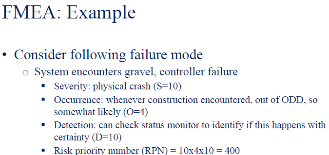

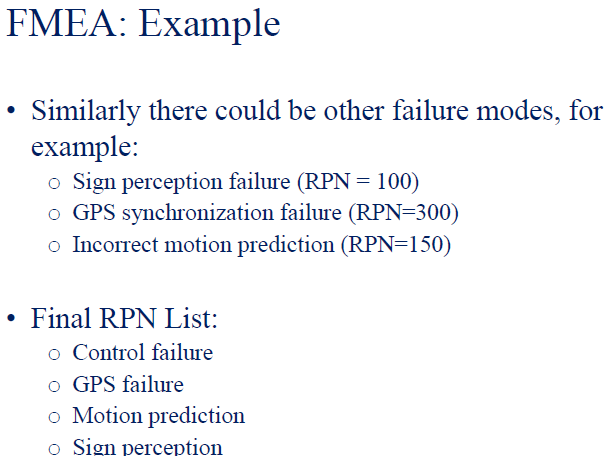

### Functional Safety Process

The functional safety process follows a V-shaped flow. Starting at the top left with requirements specification then analysis of hazards and risks and proceeding to implementation of functionality. We then climb up the right branch to confirm the design goals have been met. We start with low-level verifications such as software unit tests, and then proceed to subsystem and full system validation through simulation, test track, operations and on-road testing. As we descend the V on the left, high-level requirements turn into low-level implementations. And as we climb the V on the right, we confirm each low-level function implementation before combining them to confirm system requirements for safe operation. The final step is a summary functional safety assessment, to evaluate residual risk and determine if our system has reached an acceptable level of safety.

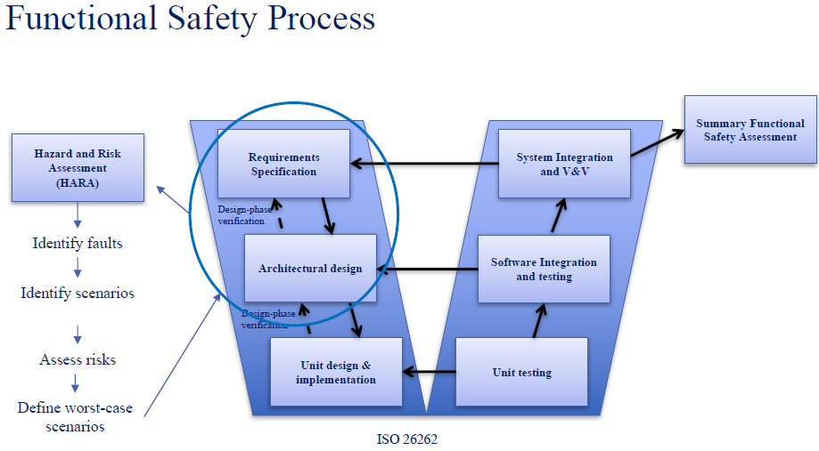

At the start of the functional safety V, we use HARA or Hazard and Risk Assessment. The HARA process sets the design goals for the system in a way that is aware of all of the worst-case failures that can occur. Through validation confirms that these worst-case failures are handled with only reasonable risk. And this is the main idea behind functional safety. You focus on worst-case requirements and then implement hardware and software that can at least handle these worst-case requirements.

### Safety of the Intended Functionality (SOTIF)

> ISO/PAS 21448.1

> Failures due to performance limitations and misuse
>   * Sensor limitations
>   * Algorithm failures / insufficiencies
>   * User misuse – overload, confusion

> Designed for level 0-2 autonomy

> Extension of FuSa
>   * V-shaped process
>   * Employs HARA

## Summary

> Simple analytic frameworks
>   * fault trees and probabilistic fault trees
>   * Failure modes and effects analysis

> Functional safety frameworks
>   * FuSa HARA - safety requirements through risk analysis
>   * SOTIF – behavior risk assessment